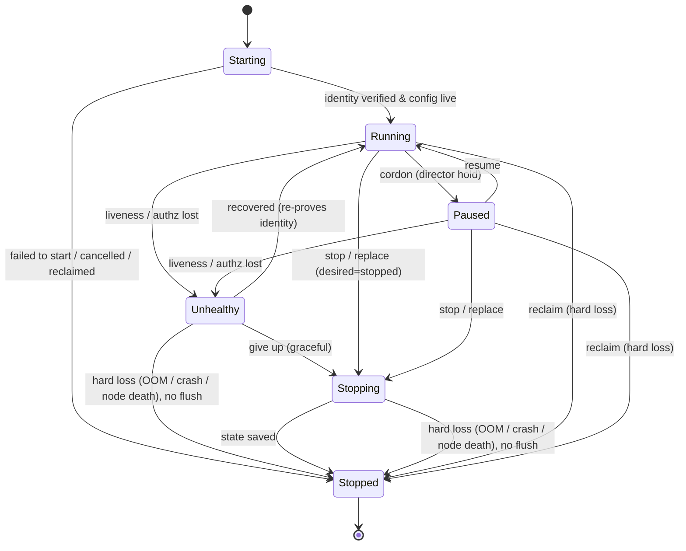

# ADR: Agent Lifecycle State Machine

- **Status:** Accepted
- **Date:** 2026-08-08
- **Author:** @brettchien
- **Reviewers:** Mira (ECS), Jellyfish (control-plane), Falcon (MCP) — all LGTM
- **Tracking issues:** implementation openabdev/studio#2

> **Y-statement.** In the context of running agents across heterogeneous
> runtimes, facing the need for one glanceable, runtime-independent notion of
> "what state is this agent in", we decided a canonical **6-state** lifecycle
> discriminated by `(desiredStatus, accepting_work, health, identity_verified)`,
> to get a
> **single-field dispatch predicate** and a clean native→canonical projection,
> accepting a sixth state and a per-runtime projection/conformance burden.

---

## 1. Context & Problem

openab runs agents across different runtimes (ECS today; k8s / GKE /
docker-compose planned). We need one runtime-independent way to say "what state
is this agent in" that: any engineer reads at a glance; is identical regardless
of the runtime underneath; and is what the control plane observes and the
director acts on.

Humans direct; agents do control. The control plane must classify every
agent, at any moment, into **exactly one** state.

## 2. Decision Drivers

- **One-glance comprehension** — a small, mutually-exclusive, exhaustive set.
- **Single-field dispatch** — "may this agent take new work?" should be one
  field, not a conjunction every caller must remember.
- **Runtime-independent, decidable projection** — each driver must map native
  signals onto the canonical set *without ambiguity*.
- **Honest about faults vs intent vs teardown** — health, admission policy, and
  terminate-intent are different axes and must not be conflated.

## 3. Decision

Every agent is in exactly one of **6 states**, discriminated by four observable
axes — `desiredStatus` (running / stopped), `accepting_work` (bool), `health`
(lease/probe/authz in-sync & authorized — **not** version-skew, which is healthy
and routes to Paused / not), and `identity_verified` (a **latching** bit: set
true the first time the agent reaches Running, never cleared). The latch is what
separates `Starting` (never verified) from `Unhealthy` (was verified, now
faulted) — without it their `(desiredStatus, accepting_work, health)` tuples
collide. It is CP-observable per runtime: ECS `lastStatus` ever reached RUNNING /
k8s ever Ready / compose ever healthy.

`Stopping` and `Stopped` share `desiredStatus==stopped` and are **not** separated
by the four axes; the discriminator is a fifth signal — **process liveness /
terminality** (graceful window open vs. absorbing, per principle 3).

| State | Discriminator | Definition | The one thing that matters |
|---|---|---|---|
| **Starting** | desired=running ∧ ¬identity_verified | CP provisions an authenticated config and injects it; the agent proves identity before it runs. | Identity is bound and verified by the control plane — never self-asserted. A **per-instance** credential is minted here. |
| **Running** | desired=running ∧ identity_verified ∧ accepting_work ∧ healthy | Alive, authorized, in-sync, and admitting work. | **Only Running admits new work** → dispatch/gate is the single predicate `state == Running`. |
| **Paused** | desired=running ∧ identity_verified ∧ ¬accepting_work ∧ healthy | Healthy and in-sync but deliberately not admitting (director cordon). | Intent, not fault. Resumable; still subject to health edges. Keeping it a peer state is what keeps the dispatch predicate single-field. |
| **Unhealthy** | desired=running ∧ identity_verified ∧ ¬healthy | Alive but fenced: liveness/authz/probe/lease lost. **Not** version skew. | Fenced at once; recover within a window (re-prove identity) or go to Stopping. Split cause: *observed-bad* vs *unobservable* (node lost). |
| **Stopping** | desired=stopped; graceful window open | Terminate committed: flush state and finish in-flight work within a deadline (may still be health-OK). | `desiredStatus==stopped` is the cross-runtime discriminator. Durability was already secured while Running. The graceful window is the only thing holding this state open: a hard loss closes it the other way (§6 — each runtime's terminal observation), and the flush is lost. |
| **Stopped** | terminal (absorbing) | Terminated. Not resurrected; a replacement is a fresh instance. | Record the cause (normative enum: normal / crash / reclaimed). A hard loss **during** `Stopping` is `crash`/`reclaimed`, never `normal` — the flush did not complete, so no state was saved. Granularity is **instance-level**. |

**Attributes, not states** (read alongside the state): `accepting_work`
(Running vs Paused) — its authority is the **CP/director**, never the agent's
self-report; `superseded` / version-skew (a healthy instance whose desired
version has moved on) is **not a state**: the CP derives it from the desired
spec and expresses it through the *same single field* as a director cordon
(`accepting_work=false`), so the instance classifies as **Paused** and is never
dispatched new work — an instance that is both cordoned and superseded is still
exactly one `Paused`. *When* the old instance is drained or replaced, and *in
what order* relative to its replacement, is a **fleet-level rollout** concern
(e.g. make-before-break) for the rollout / RuntimeDriver ADR, not an instance
question; nothing here implies an ordering, an overlap window, or a grace
period. Also: health `cause` = observed-bad vs unobservable; death `cause` enum;
turn-level busy/idle.

## 4. Principles

1. **Default-deny identity.** Identity is proven with a control-plane-issued
   credential, never accepted from the agent's own claim. The **trust root is
   the runtime's injection primitive** (IRSA / k8s projected SA token) that
   delegates a platform identity — state it explicitly. **Role identity ≠
   instance identity**: mint a **per-instance** credential at `Starting`.
2. **Trust & sync are continuous.** Heartbeat carries a CP-signed, short-TTL
   **lease token bound to the instance id** (task ARN / pod UID). A **monotonic
   fencing epoch** guards generations — the CP accepts only the highest epoch,
   defeating zombie/split-brain after a partition. Credentials are revoked on
   Stopping/Stopped; `Unhealthy→Running` must re-prove identity.
3. **Only `Stopped` is terminal (absorbing), at instance granularity.** A
   container restart within the same pod is the *same* instance, not a
   `Stopped→Starting` flap; restart = a new lifecycle only when a new instance
   is created.
4. **`reclaim` is two paths, not one.** A *planned* interruption (Spot/preempt
   notice — ECS ~120s SIGTERM, GKE ~30s + preStop) **compresses `Stopping`**
   into a short deadline. Only a *hard* loss (node death / SIGKILL / OOM) jumps
   straight to `Stopped`, and it does so **from any live state — including one
   already in `Stopping`**: the graceful `Stopping→Stopped` edge is then never
   taken, the flush is lost, and the instance lands in `Stopped` with cause
   `crash`/`reclaimed`, never `normal`. Durability never relies on the Stopping
   window — **checkpoint while Running.**
5. **Runtime-independent.** Each driver projects native signals onto the 6 via
   the discriminators `(desiredStatus, accepting_work, health, identity_verified)`;
   the machine never changes per runtime.
6. **Two predicates, kept apart.** *Dispatch new work* = `state == Running`
   (single field). *Doing in-flight work* = `Running ∪ Paused ∪ Stopping` (within
   deadline) — a cordoned (Paused) agent still finishes its current turn / MCP
   call. Don't collapse them into one sentence.

## 5. Model: config vs observed

`Instance = Desired Spec (identity + version) + Observed State`. Desired and
observed are strictly separated; **state is observed, not part of the desired
config**. "In sync" (Running) means the reconcile loop has zero diff on the
desired spec. (This replaces the earlier `config = identity + version + state`,
which folded observed state into desired config and could never reconcile to
zero diff.)

## 6. Runtime Independence (projection)

Discriminators, not native strings. `desiredStatus==stopped` is one signal
across runtimes: **ECS `desiredStatus STOPPED` ⟺ k8s `deletionTimestamp!=null`
⟺ compose stop-requested** — that is what makes `Stopping` decidable rather than
an ECS-only coincidence.

| canonical | ECS | k8s / GKE | docker-compose |
|---|---|---|---|
| Starting | **PROVISIONING** (ENI) / PENDING / ACTIVATING (image pull + secret inject) | Pending / ContainerCreating / startupProbe pending | created / starting |
| Running | RUNNING + health OK + desiredStatus RUNNING | Running + readinessProbe True + lease valid | healthy *(healthcheck required)* |
| Paused | RUNNING + health OK + CP/director cordon (`accepting_work=false`) | Ready but cordoned (CP/director) | running + CP/director cordon |
| Unhealthy | RUNNING + healthStatus UNHEALTHY / lease lost *(attribute, not a task state)* | readiness/liveness fail; **Unknown (node lost) → Unhealthy(fenced) + epoch fence**; CrashLoopBackOff | healthcheck fail; `docker pause` (cgroup freezer) → healthcheck stall → Unhealthy |
| Stopping | desiredStatus STOPPED *(DEACTIVATING only if in a target group / service-discovery; else RUNNING→STOPPING)* | deletionTimestamp != null (Terminating: preStop + grace) | stop requested (stop_grace_period) |
| Stopped | STOPPED + stopCode (enum) | deleted; *preempted* = the reclaim edge | exited |

**Driver conformance conditions**
- A driver must expose all four discriminators (including the latching
  `identity_verified`); if it cannot, it does not conform.
- **docker-compose requires a `healthcheck`** — without one it only sees
  running/exited and can never separate Running from Unhealthy.
- **docker-compose must set `restart: "no"`** and hand restart to the control
  plane; `restart: unless-stopped` auto-resurrects a crashed container, which
  contradicts "Stopped is terminal" and competes with reclaim/replace.

## 7. Considered Options

- **6 states with Paused as a peer state (chosen).** Uses the discriminators to
  define Paused rigorously; keeps dispatch single-field.
- **5 states, Paused/Draining as a `Running` attribute** (reviewers' converged
  proposal) — *rejected as the surface model* because it forces a two-field
  dispatch predicate (`Running && accepting_work`); every caller that forgets
  `&& accepting_work` silently mis-schedules a paused agent. **We adopt its
  `(desiredStatus, accepting_work)` machinery as Paused's definition.**
- **Hermes' 6 operational states verbatim** — rejected: mixes install/service
  concerns with runtime state; path/name identity is the self-report we reject.
- **pi `idle/turn` as the primary machine** — rejected: a sub-layer of Running.
- **K8s granular phases** (Pending/Running/Succeeded/Failed/Unknown + container
  states) — rejected for the surface set; folded into attributes.
- **Drop `Unhealthy`** — rejected: loses the "alive but fenced" distinction.

## 8. Prior Art

| Project | Model | What we take / differ |
|---|---|---|
| **Kubernetes** Pod lifecycle | Phase + Conditions + Probes (three-layer decoupling); `Unknown` on node loss | Direct ancestor; we take the phase/condition/probe split; `Unknown`→Unhealthy(fenced). |
| **HashiCorp Nomad** | alloc states pending/running/complete/failed/**lost**; driver preemption events | `lost`/`unknown` is exactly our *unobservable* Unhealthy case. |
| **Temporal / Cadence** | workflow/activity states + heartbeat **lease fencing** | Validates the fencing epoch on the heartbeat lease. |
| **Erlang/OTP supervisor** | child spec + crash exit reason + `one_for_one`; restart spawns a new child | Supports "restart = new lifecycle / fresh instance". |
| **AWS EC2 instance lifecycle** | pending/running/stopping/stopped/terminated | Near-identical shape; instance-level granularity. |
| **systemd unit** | active / **failed** / … as first-class | `failed` as a first-class fault state. |
| **Ray actor** | PENDING / ALIVE / RESTARTING / DEAD | Close 1:1; `RESTARTING` = our replace path. |
| **Hermes / Pi / Pi-Desktop** | ops CLI states / in-process turn engine / desktop shell | Adjacent code, not instance-level lifecycle. Pi validates **checkpoint-while-Running**. |

## 9. Consequences

- The read-model and Studio report **only these 6 states**.
- Every runtime driver must provide a **native→6 projection** via the
  discriminators (conformance requirement), including the compose healthcheck
  and `restart:"no"` conditions above.
- Detailed sub-states are **attributes** of the 6 (accepting_work, superseded,
  health-cause, death-cause enum, busy/idle), not new states.
- **Follow-ups:** a `RuntimeDriver` contract ADR (verbs apply / observe / scale
  / cordon / …); an identity / lease / epoch spec ADR.
- **Follow-up (the `State.Paused` naming item, openabdev/studio#3):** the
  `RuntimeDriver` contract ADR — the follow-up named just above, not yet written —
  must fix the enum it exposes and that enum's serialized name. The model today
  is `AgentState` with a `Paused` variant (`crates/agent-lifecycle`), and the
  review item asks whether the contract should read `State.Paused` instead. ADR-1
  settles the **semantics** and leaves the **spelling** to the contract ADR. The
  constraint that carries forward either way: `Paused` must stay the value of
  **one field** whose single `Running` case *is* the whole dispatch predicate
  (§4 principle 6) — so *turning it into a flag* is the expensive move (§7), and
  even a plain rename is not free at the published surface (see below).

### Lock-in and cost to reverse

What this ADR locks in is mostly a **published surface**, not an implementation.

**Cheap to reverse:** the `cause` enum value sets (additive — a new value leaves
existing readers' current meaning intact, and these are printed names rather than
a versioned wire enum), and adding a runtime driver (a new projection, never a
change to the machine). The attribute *names* are **not** in this bucket — see
the discriminator shape below.

**Expensive to reverse:**

- **The 6-state set.** It is the canonical `AgentState` in
  `crates/agent-lifecycle`, the value of `phase` in ADR-2's read model, and the
  string the MCP tools publish (`crates/oab-mcp` emits
  `"state": format!("{:?}", phase)`; the type has no serde derive). The console
  skin mirrors those literals as a TypeScript union (`console/src/types.ts`) and
  keys a badge class off them (`STATE_CLASS` in `console/src/render.ts`), so the
  *names* are a cross-language contract: renaming one breaks the Rust/TypeScript
  pair — and breaks it *quietly*, since an unrecognised value renders no class
  rather than raising — even though nothing in Rust parses the string back.
- **The single-field dispatch predicate** (`state == Running`). Reverting to a
  two-field predicate does not fail loudly — it fails by *silently* scheduling
  cordoned agents, which is precisely the failure mode §7 rejected. This is the
  most expensive item here, and the reason `Paused` stays a peer state rather
  than becoming an attribute.
- **`Stopped` as terminal, at instance granularity.** Un-absorbing it (a
  container restart becoming a `Stopped→Starting` flap) rewrites what an
  "instance" is, and invalidates both the latching `identity_verified` bit and
  the death `cause` enum: history already observed has to be re-read under the
  new meaning.
- **The four-axis discriminator shape.** Drivers conform to it
  (`RuntimeDriver::project`), so reshaping it is a conformance break for every
  driver — ECS and k8s alike — not a refactor behind one call site.
- **The identity mechanism** — the per-instance credential at `Starting`, the
  CP-signed lease bound to the instance id, the fencing epoch and revocation on
  Stopping/Stopped (§4 principles 1–2). Only the latch is written down in code
  (`IdentityLatch` in `crates/agent-lifecycle`), and even that is not yet wired:
  the control plane still threads a caller-supplied `verified_before` into
  `RuntimeDriver::project` (`crates/studio-cp`). So the lock-in is on the
  **specification**: once drivers and the CP exist, changing it means re-proving
  identity for every live instance — an operational migration, not a rename —
  whereas changing it while it is still prose is nearly free. Any change must
  also preserve what `identity_verified == true` already meant for the instances
  classified with it.

Reversal comes as a **mapping plus a deprecation window** — publish both
surfaces, move consumers, then drop one — never an in-place edit; being a
*projection* of runtime signals is what lets a second surface coexist at all.
What cannot be undone in place is a consumer's compiled-in assumption that one
field answers "may this agent take new work?". The identity mechanism is the
exception: two fencing-epoch / credential schemes cannot be dual-published, so
changing it is the operational migration above, not a windowed deprecation.

## 10. More Information

Format follows **MADR** (markdown ADR: context → drivers → options → decision →
consequences) with a **Nygard** status/context/decision/consequences spine and a
**Y-statement** summary. See `docs/review-runbook.md` for the review rubric this
ADR was gated on.
